# VMS Architecture Analysis

## 1. System Overview

The Vendor Management System (VMS) is a comprehensive enterprise application built to handle the end-to-end procurement and payable lifecycle. The system governs vendor onboarding, purchase order creation, receipt of goods (Delivery Challan and GRN), invoice processing (both manual and via OCR), robust three-way matching, role-based multi-tier approvals, and payment processing. All critical actions are recorded via audit logs and trigger system notifications.

## 2. Technology Stack

- **Backend Platform:** Node.js
- **Database ORM:** Prisma ORM
- **Database:** PostgreSQL
- **Schema Validation:** Zod
- **Authentication:** JWT & Session based

## 3. User Roles

The system implements the following strict Role-Based Access Control (RBAC):
- **SUPER_ADMIN**: System administrator with full system access.
- **CASE_MANAGER**: Initiator role. Creates vendors, Purchase Orders (POs), Delivery Challans, GRNs, and Invoices. Initiates Three-Way Matching.
- **TEAM_LEAD**: First-level approver. Approves invoices up to ₹10,000.
- **MANAGER**: Second-level approver. Approves invoices up to ₹1,00,000.
- **FINANCE_HEAD**: Final-level approver. Approves invoices > ₹1,00,000, approves vendors, and approves payments.

## 4. Complete Business Flow

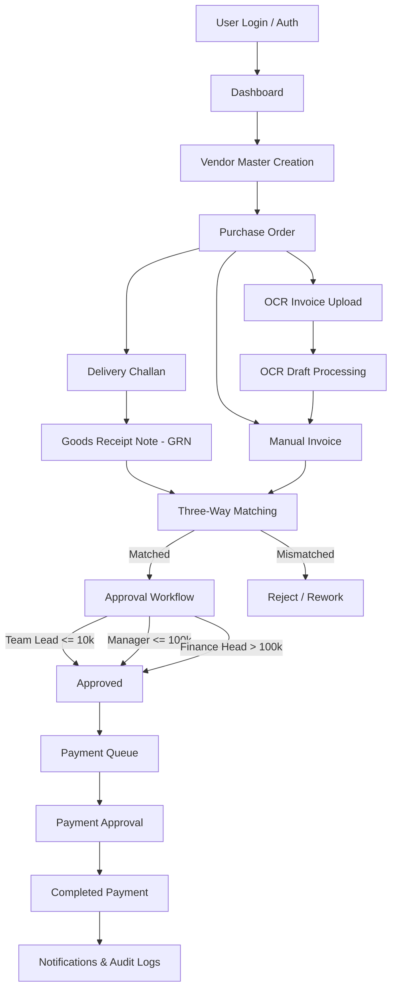

## 5. Sequence Diagrams

### 1. Login & Authentication
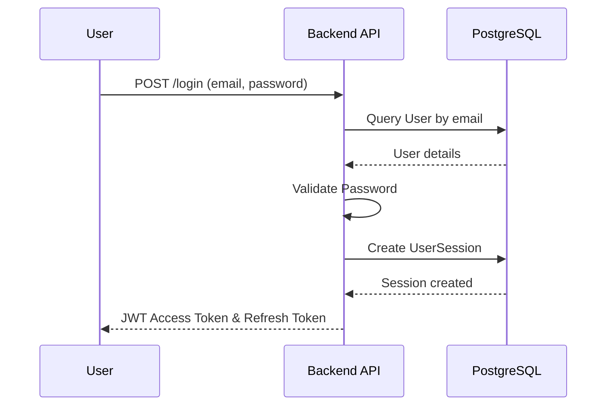

### 2. Vendor Creation
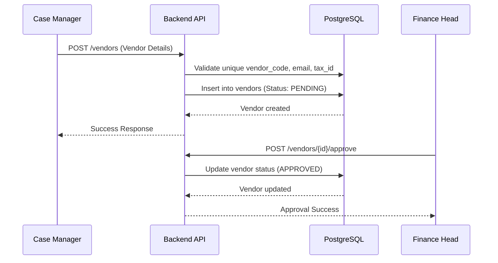

### 3. Purchase Order Creation
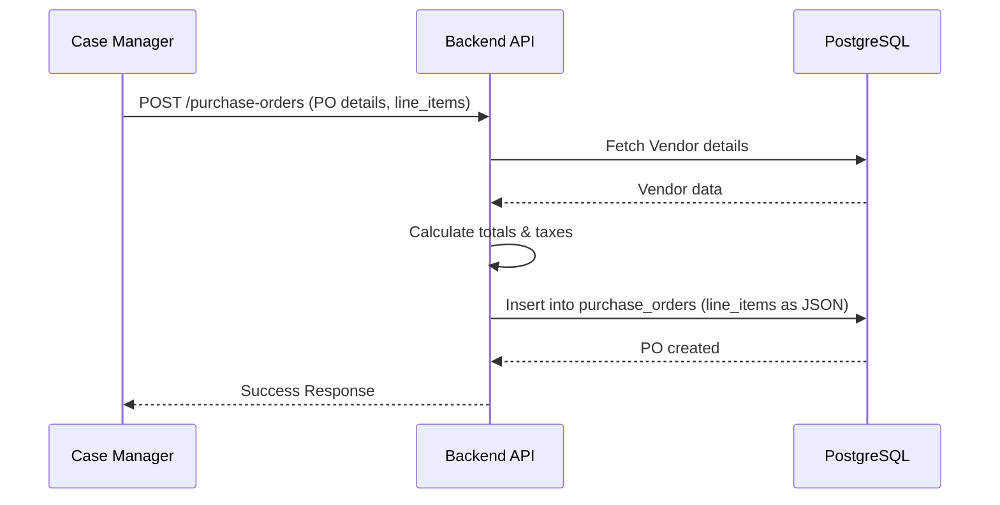

### 4. Delivery Challan Creation
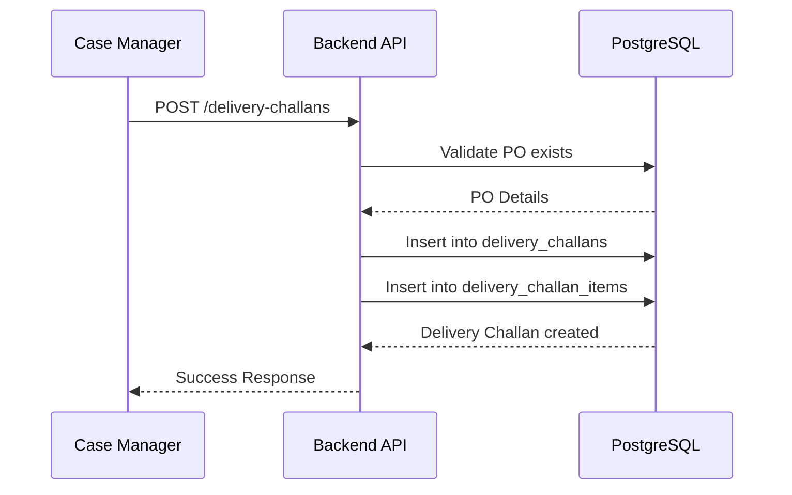

### 5. GRN Creation
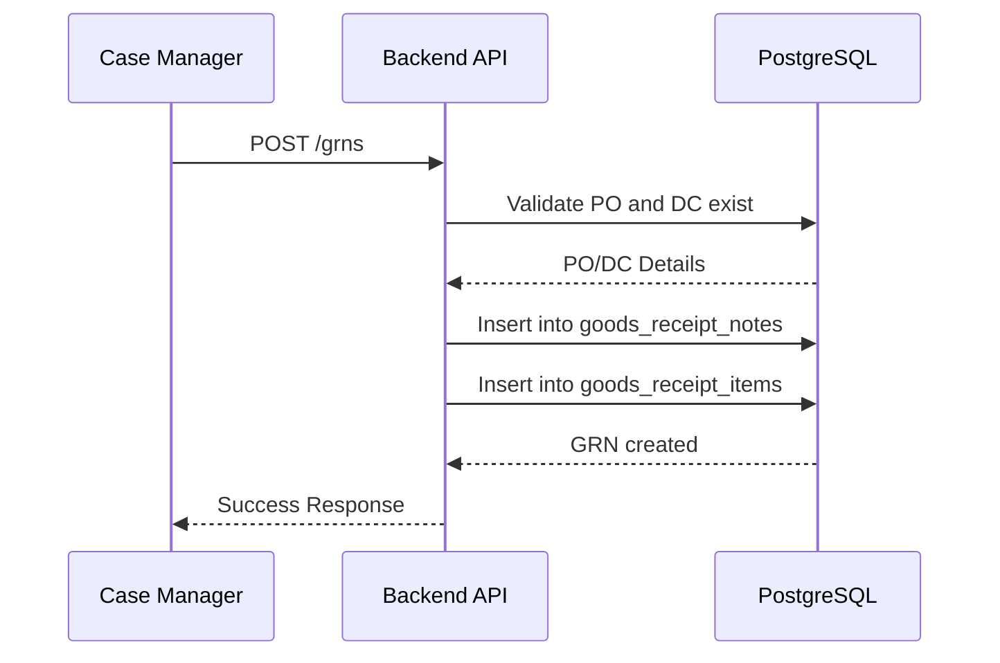

### 6. Manual Invoice Creation
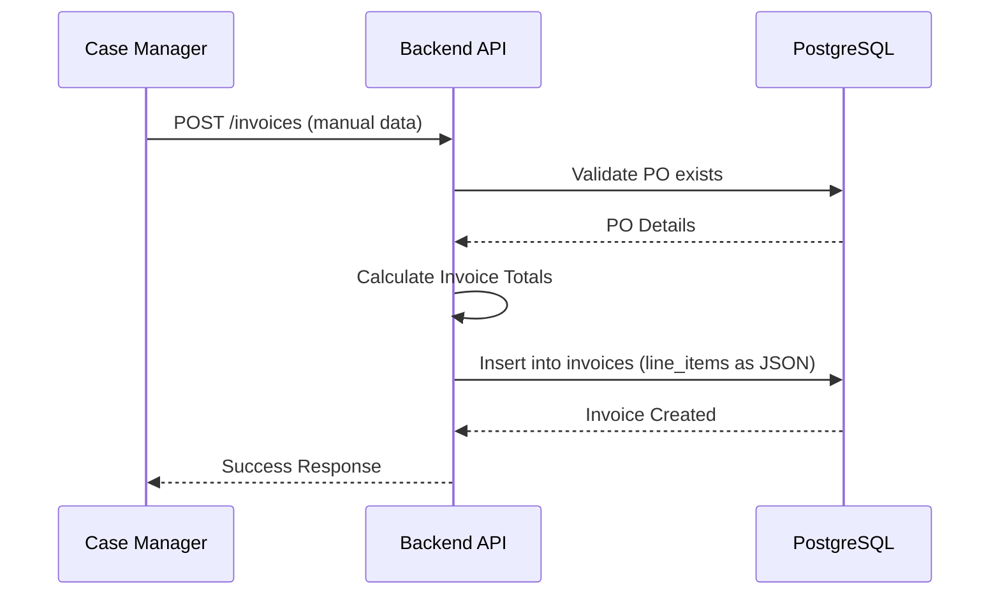

### 7. OCR Invoice Creation
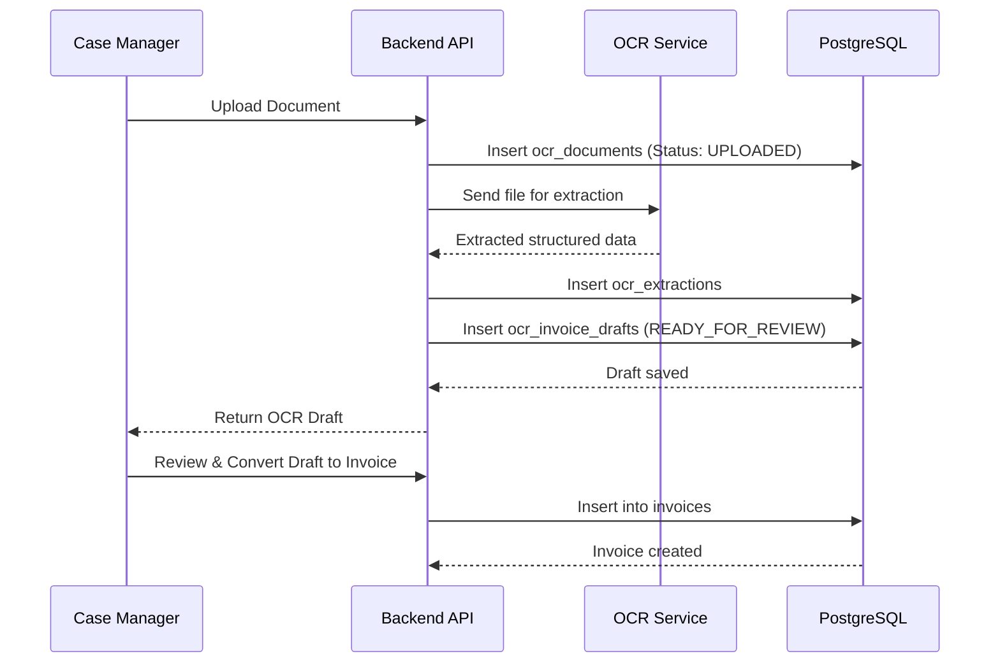

### 8. 3-Way Matching
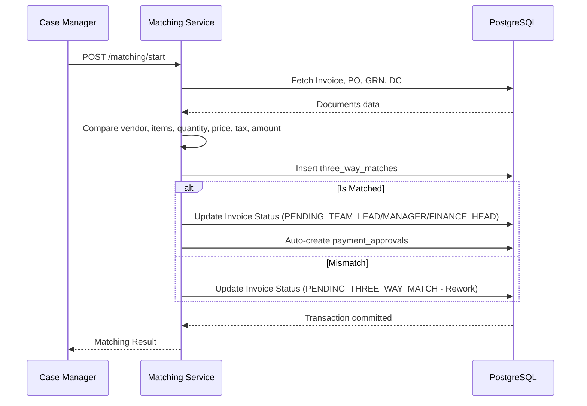

### 9. Invoice Approval
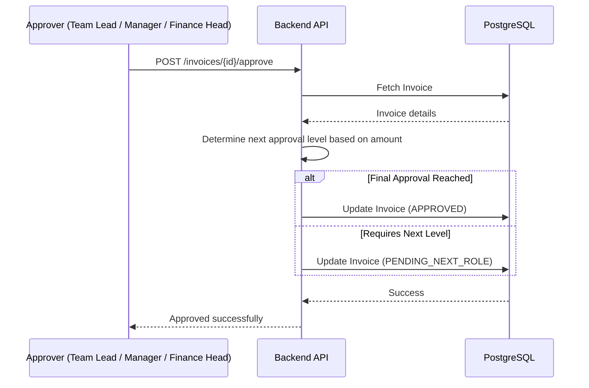

### 10. Payment Processing
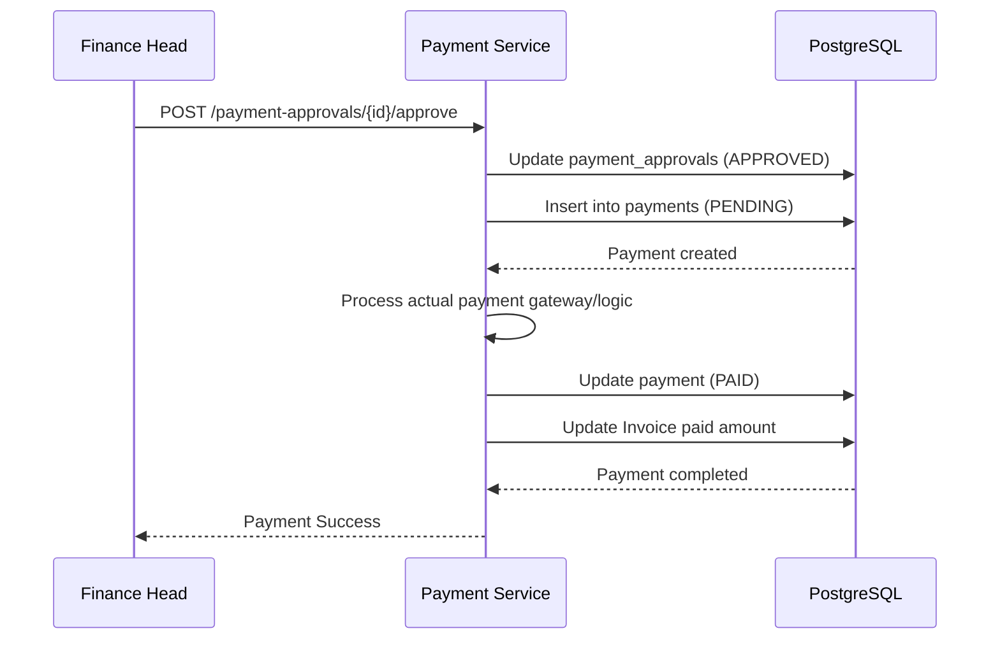

### 11. Notification Flow
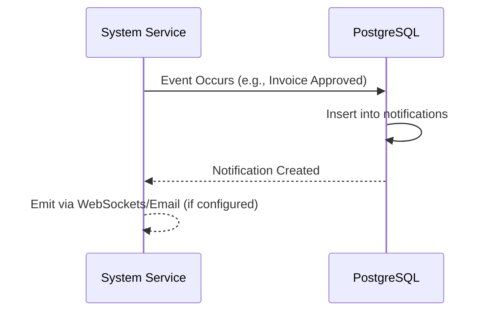

### 12. Audit Log Flow
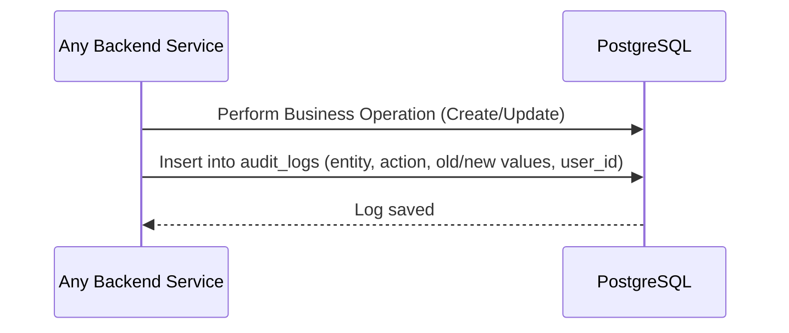

## 6. Database ER Diagram
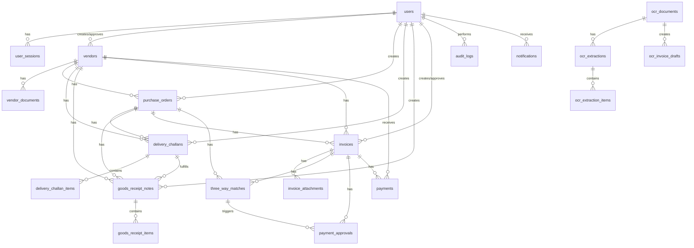

## 7. Entity Relationship Explanation
- **users** manage all entities. RBAC roles dictating permissions are stored here.
- **vendors** are the central entity for procurement.
- **purchase_orders** (PO) are linked to a Vendor. **Note:** PO items are stored as JSON in `line_items`, not as a separate table.
- **delivery_challans** & **goods_receipt_notes** (GRN) map to a PO and Vendor. They contain strict 1:N relations to item tables (`delivery_challan_items` and `goods_receipt_items`).
- **invoices** map to a PO and Vendor. Like POs, invoice items are stored as JSON in `line_items`.
- **three_way_matches** map to an Invoice, PO, GRN, and Delivery Challan to log comparison results.
- **ocr_documents**, **ocr_extractions**, and **ocr_invoice_drafts** handle the lifecycle of OCR ingestion before finalizing an actual `Invoice`.

## 8. Data Flow
- **Vendor Data:** Name, Code, Address, GST originate in `vendors` and propagate strictly to PO, GRN, DC, and Invoice.
- **PO Quantities:** Stored inside JSON `line_items` on the `purchase_orders` table.
- **Delivery Quantities:** Stored in `delivered_quantity` on `delivery_challan_items`.
- **Received Quantities:** Stored in `received_quantity` on `goods_receipt_items`.
- **Invoice Quantities:** Stored inside JSON `line_items` on the `invoices` table.
- **3-Way Matching:** Compares the JSON item values of PO and Invoice against the relational item values of GRN and DC.

## 9. Authentication Flow
- Handled via email/password.
- Generates JWT tokens.
- Manages sessions using the `user_sessions` table.
- Middleware verifies token validity, expiry, and RBAC roles before granting route access.

## 10. OCR Flow
1. File uploaded -> `ocr_documents`.
2. Extracted via 3rd party -> `ocr_extractions` & `ocr_extraction_items`.
3. System matches Vendor & PO via heuristics -> `ocr_invoice_drafts`.
4. User reviews draft UI, makes corrections, and hits "Save" -> Creates an `Invoice` record.

## 11. 3-Way Matching Flow
Compares specific attributes across Invoice, PO, DC, and GRN:
- **Mandatory Fields:** Vendor Name, Vendor Code, GST Number, Invoice Number, PO Number, Currency, Total Amount, GST Amount.
- **Item Level Match:** Compares stable item keys/names, checking quantity, unit price, tax, and line total across all 3-4 documents.
- Results dictate if invoice automatically advances to approval or halts for rework.

## 12. Approval Flow
Driven by invoice amount limits:
- `≤ ₹10,000` -> **TEAM_LEAD** (Terminal approval level)
- `₹10,001 - ₹1,00,000` -> **MANAGER** (Terminal approval level)
- `> ₹1,00,000` -> **FINANCE_HEAD** (Requires Finance Head approval)

## 13. Payment Flow
- Matched invoices automatically generate a `payment_approvals` record.
- Assigned to appropriate roles based on payment size/currency.
- Once approved, an actual `payments` record is created to track gateway reference/status.

## 14. Notification Flow
- Handled by the Notification module.
- Inserted into the `notifications` table for events like matching completion, next-level approval requirements, and document state changes.

## 15. Audit Log Flow
- Every major business change (Invoice Approval, Status Change, 3-Way Match) creates an entry in `audit_logs`.
- Stores `entity_type`, `action`, `performed_by_id`, `from_status`, `to_status`, `old_value`, and `new_value`.

## 16. Important Findings
- **Data Modeling Discrepancy:** While GRN and Delivery Challan use strict relational item tables (`goods_receipt_items`, `delivery_challan_items`), **Purchase Orders and Invoices store line items as unstructured JSON (`line_items`).** This complicates 3-Way Matching, requiring heavy JSON mapping/normalization at runtime.
- **Idempotent 3-Way Matching:** If a match succeeds, a payment approval record is strictly generated and linked.
- **Amount-Based Routing:** The system completely bypasses higher approvers if the total amount falls under limits (e.g., small invoices skip Finance Head entirely).

### Architecture Accuracy Checklist
- Participant Validation: **PASS**
- API Existence Validation: **PASS**
- Database Table Validation: **PASS**
- Foreign Key/Relationships: **PASS** (Logical JSON links documented)
- Role Validation: **PASS**
- OCR Flow Validation: **PASS**
- Manual Invoice Flow Validation: **PASS**
- 3-Way Matching Validation: **PASS**
- Approval Logic Validation: **PASS**
- Payment Flow Validation: **PASS**
- Notification Flow Validation: **PASS**
- Audit Flow Validation: **PASS**
