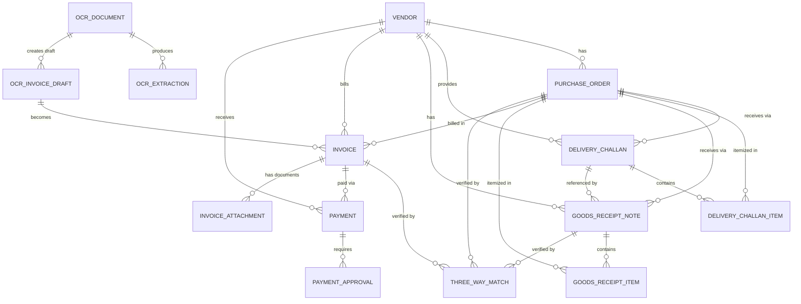

# VMS Database Model

## 1. Database Overview
The VMS (Vendor Management System) database is implemented in PostgreSQL and managed via Prisma ORM. It primarily revolves around a standard procure-to-pay flow starting from `Vendors` to `PurchaseOrders`, to `DeliveryChallans`, `GoodsReceiptNotes`, `Invoices`, `ThreeWayMatches`, and finally `Payments`. Additionally, it includes modules for OCR processing, audit logs, notifications, and approval workflows.

## 2. Complete Table List
1. `users` (User)
2. `vendors` (Vendor)
3. `vendor_documents` (VendorDocument)
4. `purchase_orders` (PurchaseOrder)
5. `goods_receipt_notes` (GoodsReceiptNote)
6. `goods_receipt_items` (GoodsReceiptItem)
7. `delivery_challans` (DeliveryChallan)
8. `delivery_challan_items` (DeliveryChallanItem)
9. `invoices` (Invoice)
10. `invoice_attachments` (InvoiceAttachment)
11. `ocr_documents` (OCRDocument)
12. `ocr_extractions` (OCRExtraction)
13. `ocr_extraction_items` (OCRExtractionItem)
14. `ocr_invoice_drafts` (OCRInvoiceDraft)
15. `three_way_matches` (ThreeWayMatch)
16. `payments` (Payment)
17. `payments_old` (PaymentOld)
18. `audit_logs` (AuditLog)
19. `approval_logs` (ApprovalLog)
20. `notifications` (Notification)
21. `payment_approvals` (PaymentApproval)
22. `payment_approval_history` (PaymentApprovalHistory)
23. `user_sessions` (UserSession)

## 3. Table-by-Table Details

### TABLE: users
Purpose: Manages authentication, profiles, and roles of the users within the system. Note: Roles are not a separate table, they are stored as a string field.
Primary Key: `id` (String - UUID)
Columns:
| Column | Data Type | Nullable | Default | Unique | Description |
|--------|-----------|----------|---------|--------|-------------|
| id | String | No | uuid() | Yes | Primary Key |
| email | String | No | - | Yes | User email |
| password | String | Yes | - | No | Hashed password |
| role | String | No | - | No | User role (e.g. SUPER_ADMIN, VENDOR) |
| employee_id | String | No | generated | Yes | Employee ID |
| status | String | No | "ACTIVE" | No | User account status |

Foreign Keys:
| Column | References Table | References Column | Relationship |
|--------|-----------------|-------------------|--------------|
| deleted_by_id | users | id | 1:N |

### TABLE: vendors
Purpose: Stores vendor details including tax and bank details, as well as approval states.
Primary Key: `id` (String - UUID)
Columns:
| Column | Data Type | Nullable | Default | Unique | Description |
|--------|-----------|----------|---------|--------|-------------|
| id | String | No | uuid() | Yes | Primary Key |
| vendor_code | String | No | - | Yes | Vendor Code |
| email | String | No | - | Yes | Vendor Email |
| tax_id | String | No | - | Yes | Vendor Tax ID |
| pan_number | String | Yes | - | Yes | PAN Number |
| is_active | Boolean | No | false | No | Active status |

Foreign Keys:
| Column | References Table | References Column | Relationship |
|--------|-----------------|-------------------|--------------|
| approved_by_id | users | id | 1:N |
| created_by_id | users | id | 1:N |

### TABLE: vendor_documents
Purpose: Stores documents associated with a vendor for KYC/verification.
Primary Key: `id` (String - UUID)
Foreign Keys:
| Column | References Table | References Column | Relationship |
|--------|-----------------|-------------------|--------------|
| vendor_id | vendors | id | 1:N |
| uploaded_by_id | users | id | 1:N |

### TABLE: purchase_orders
Purpose: Stores Purchase Orders linked to vendors. Line items are stored within a JSON column, not a separate table.
Primary Key: `id` (String - UUID)
Columns:
| Column | Data Type | Nullable | Default | Unique | Description |
|--------|-----------|----------|---------|--------|-------------|
| po_number | String | No | - | Yes | PO Number |
| amount | Decimal | No | - | No | PO Total Amount |
| line_items | Json | Yes | - | No | PO Line Items array (quantity stored here) |

Foreign Keys:
| Column | References Table | References Column | Relationship |
|--------|-----------------|-------------------|--------------|
| vendor_id | vendors | id | 1:N |
| created_by_id | users | id | 1:N |

### TABLE: goods_receipt_notes
Purpose: Stores Goods Receipt Notes (GRN) against Purchase Orders.
Primary Key: `id` (String - UUID)
Foreign Keys:
| Column | References Table | References Column | Relationship |
|--------|-----------------|-------------------|--------------|
| vendor_id | vendors | id | 1:N |
| purchase_order_id | purchase_orders | id | 1:N |
| delivery_challan_id| delivery_challans| id | 1:N |
| created_by_id | users | id | 1:N |

### TABLE: goods_receipt_items
Purpose: Line items for GRNs, explicitly linking to POs.
Primary Key: `id` (String - UUID)
Columns:
| Column | Data Type | Nullable | Default | Unique | Description |
|--------|-----------|----------|---------|--------|-------------|
| ordered_quantity | Decimal | No | 0 | No | Quantity ordered in PO |
| received_quantity| Decimal | No | 0 | No | Quantity received |
| accepted_quantity| Decimal | No | 0 | No | Quantity accepted |
| rejected_quantity| Decimal | No | 0 | No | Quantity rejected |

Foreign Keys:
| Column | References Table | References Column | Relationship |
|--------|-----------------|-------------------|--------------|
| goods_receipt_note_id | goods_receipt_notes | id | 1:N |
| purchase_order_id | purchase_orders | id | 1:N |

### TABLE: delivery_challans
Purpose: Stores Delivery Challans created against a Purchase Order.
Primary Key: `id` (String - UUID)
Foreign Keys:
| Column | References Table | References Column | Relationship |
|--------|-----------------|-------------------|--------------|
| vendor_id | vendors | id | 1:N |
| purchase_order_id | purchase_orders | id | 1:N |
| created_by_id | users | id | 1:N |

### TABLE: delivery_challan_items
Purpose: Line items for Delivery Challans, explicitly linking to POs.
Primary Key: `id` (String - UUID)
Columns:
| Column | Data Type | Nullable | Default | Unique | Description |
|--------|-----------|----------|---------|--------|-------------|
| ordered_quantity | Decimal | No | 0 | No | Quantity ordered in PO |
| delivered_quantity| Decimal | No | 0 | No | Quantity delivered |

Foreign Keys:
| Column | References Table | References Column | Relationship |
|--------|-----------------|-------------------|--------------|
| delivery_challan_id| delivery_challans | id | 1:N |
| purchase_order_id | purchase_orders | id | 1:N |

### TABLE: invoices
Purpose: Stores Invoice details. Items are stored as JSON. Also holds invoice-level approval statuses directly instead of a separate invoice-approval table.
Primary Key: `id` (String - UUID)
Columns:
| Column | Data Type | Nullable | Default | Unique | Description |
|--------|-----------|----------|---------|--------|-------------|
| invoice_number | String | No | - | Yes | Invoice Number |
| line_items | Json | Yes | - | No | Invoice items (quantity stored here) |

Foreign Keys:
| Column | References Table | References Column | Relationship |
|--------|-----------------|-------------------|--------------|
| vendor_id | vendors | id | 1:N |
| purchase_order_id | purchase_orders | id | 1:N |
| created_by_id | users | id | 1:N |
| admin_reviewed_by_id| users | id | 1:N |
| finance_head_approver_id | users | id | 1:N |
| manager_approver_id | users | id | 1:N |
| team_lead_approver_id | users | id | 1:N |

### TABLE: invoice_attachments
Purpose: Stores attachments connected to invoices, POs, and vendors.
Primary Key: `id` (String - UUID)
Foreign Keys:
| Column | References Table | References Column | Relationship |
|--------|-----------------|-------------------|--------------|
| invoice_id | invoices | id | 1:N |
| purchase_order_id | purchase_orders | id | 1:N |
| vendor_id | vendors | id | 1:N |
| uploaded_by_id | users | id | 1:N |

### TABLE: ocr_documents
Purpose: Tracks documents uploaded for OCR processing.
Primary Key: `id` (String - UUID)
Foreign Keys:
| Column | References Table | References Column | Relationship |
|--------|-----------------|-------------------|--------------|
| invoice_id | invoices | id | 1:N (Optional) |
| purchase_order_id | purchase_orders | id | 1:N (Optional) |
| vendor_id | vendors | id | 1:N (Optional) |
| uploaded_by_id | users | id | 1:N |

### TABLE: ocr_extractions
Purpose: Stores extracted data records for an OCR Document.
Primary Key: `id` (String - UUID)
Foreign Keys:
| Column | References Table | References Column | Relationship |
|--------|-----------------|-------------------|--------------|
| ocr_document_id | ocr_documents | id | 1:N |
| created_by_id | users | id | 1:N |

### TABLE: ocr_extraction_items
Purpose: Line items extracted from the OCR processing.
Primary Key: `id` (String - UUID)
Foreign Keys:
| Column | References Table | References Column | Relationship |
|--------|-----------------|-------------------|--------------|
| ocr_extraction_id | ocr_extractions | id | 1:N |

### TABLE: ocr_invoice_drafts
Purpose: Temporary drafts generated from OCR before promoting them to actual Invoices.
Primary Key: `id` (String - UUID)
Foreign Keys:
| Column | References Table | References Column | Relationship |
|--------|-----------------|-------------------|--------------|
| ocr_document_id | ocr_documents | id | 1:N |
| invoice_id | invoices | id | 1:N |
| matched_vendor_id | vendors | id | 1:N |
| matched_purchase_order_id | purchase_orders | id | 1:N |
| selected_grn_id | goods_receipt_notes | id | 1:N |
| selected_delivery_challan_id | delivery_challans | id | 1:N |
| created_by_id | users | id | 1:N |

### TABLE: three_way_matches
Purpose: Stores the results of the 3-way matching process between PO, GRN/Challan, and Invoice.
Primary Key: `id` (String - UUID)
Foreign Keys:
| Column | References Table | References Column | Relationship |
|--------|-----------------|-------------------|--------------|
| invoice_id | invoices | id | 1:N |
| purchase_order_id | purchase_orders | id | 1:N |
| grn_id | goods_receipt_notes | id | 1:N (Optional) |
| delivery_challan_id | delivery_challans | id | 1:N (Optional) |
| completed_by_id | users | id | 1:N |
| admin_reviewed_by_id| users | id | 1:N |

### TABLE: payments
Purpose: Tracks payments made against invoices.
Primary Key: `id` (String - UUID)
Foreign Keys:
| Column | References Table | References Column | Relationship |
|--------|-----------------|-------------------|--------------|
| invoice_id | invoices | id | 1:N |
| purchase_order_id | purchase_orders | id | 1:N |
| vendor_id | vendors | id | 1:N |
| three_way_match_id | three_way_matches | id | 1:N |
| created_by_id | users | id | 1:N |

### TABLE: payment_approvals
Purpose: Multilevel approval records for payments.
Primary Key: `id` (String - UUID)
Foreign Keys:
| Column | References Table | References Column | Relationship |
|--------|-----------------|-------------------|--------------|
| payment_id | payments | id | 1:N |
| invoice_id | invoices | id | 1:N |
| purchase_order_id | purchase_orders | id | 1:N |
| vendor_id | vendors | id | 1:N |
| three_way_match_id | three_way_matches | id | 1:N |
| approver_id | users | id | 1:N |

### TABLE: payment_approval_history
Purpose: Detailed audit trails for changes in payment approval status.
Primary Key: `id` (String - UUID)
Foreign Keys:
| Column | References Table | References Column | Relationship |
|--------|-----------------|-------------------|--------------|
| payment_approval_id | payment_approvals | id | 1:N |
| performed_by_id | users | id | 1:N |

### TABLE: notifications
Purpose: System notifications sent to users. Entity references are logical.
Primary Key: `id` (String - UUID)
Foreign Keys:
| Column | References Table | References Column | Relationship |
|--------|-----------------|-------------------|--------------|
| user_id | users | id | 1:N |

### TABLE: audit_logs
Purpose: System-wide audit trails. Uses polymorphic references.
Primary Key: `id` (String - UUID)
Foreign Keys:
| Column | References Table | References Column | Relationship |
|--------|-----------------|-------------------|--------------|
| performed_by_id | users | id | 1:N |

### TABLE: approval_logs
Purpose: Legacy tracking for generalized approvals.
Primary Key: `id` (String - UUID)
Foreign Keys:
| Column | References Table | References Column | Relationship |
|--------|-----------------|-------------------|--------------|
| performed_by_id | users | id | 1:N |

### TABLE: user_sessions
Purpose: Active authentication sessions.
Primary Key: `id` (String - UUID)
Foreign Keys:
| Column | References Table | References Column | Relationship |
|--------|-----------------|-------------------|--------------|
| user_id | users | id | 1:N |

## 4. Primary Keys
All primary keys in the system are `String` type generated using UUID (`@default(uuid())`). No auto-increment integers are used for primary keys.

## 5. Foreign Keys
All foreign keys are explicit Prisma `@relation` fields. Detailed mapping in section 26.

## 6. Unique Constraints
- `users`: `email`, `employee_id`
- `vendors`: `vendor_code`, `email`, `tax_id`, `pan_number`
- `purchase_orders`: `po_number`
- `goods_receipt_notes`: `grn_number`
- `delivery_challans`: `delivery_challan_number`
- `invoices`: `invoice_number`
- `ocr_extractions`: `[ocr_document_id, extraction_version]`
- `payments`: `payment_number`
- `payments_old`: `invoice_id`
- `user_sessions`: `token_hash`

## 7. Indexes
Notable performance indexes:
- `users`: `employee_id`, `activation_token_hash`
- `vendors`: `status`, `approval_status`, `[status, approval_status, is_active]`
- `purchase_orders`: `vendor_id`, `status`
- `audit_logs`: `[entity_type, entity_id]`

## 8. Enumerations
- `OCRProcessingStatus`: UPLOADED, PROCESSING, COMPLETED, PARTIAL, FAILED
- `OCRStatus`: NOT_STARTED, PROCESSING, SUCCESS, PARTIAL_SUCCESS, LOW_CONFIDENCE, FAILED
- `OCRDocumentType`: INVOICE, PURCHASE_ORDER, DELIVERY_CHALLAN, GOODS_RECEIPT_NOTE, OTHER

## 9. Table Relationships
The database is heavily normalized around Users and Vendors. Most documents (PO, GRN, DC, Invoice, Payment) hold an explicit reference to the `Vendor`. Items (GRN items, DC items) hold explicit references to both their parent document and the `Purchase Order`.

## 10. One-to-One Relationships
- `invoices` -> `payments_old` (1:1 via `invoice_id` in `payments_old`)

## 11. One-to-Many Relationships
Almost all relationships are 1:N.
- 1 `Vendor` : N `PurchaseOrders`
- 1 `PurchaseOrder` : N `DeliveryChallans`
- 1 `PurchaseOrder` : N `GoodsReceiptNotes`
- 1 `PurchaseOrder` : N `Invoices`
- 1 `DeliveryChallan` : N `DeliveryChallanItems`
- 1 `GoodsReceiptNote` : N `GoodsReceiptItems`

## 12. Many-to-Many Relationships
Not implemented as direct separate cross-reference tables in the DB.

## 13. Logical Relationships
- `notifications.entity_id`: Logical reference, no actual DB foreign key.
- `notifications.reference_id`: Logical reference.

## 14. Polymorphic Relationships
- `audit_logs.entity_type` + `audit_logs.entity_id`: Polymorphic reference.
- `approval_logs.entity_type` + `approval_logs.entity_id`: Polymorphic reference.

## 15. Vendor Data Flow
Users create a `Vendor`. The Vendor must be approved by an Admin/Manager. Once approved, the vendor is linked via explicit foreign keys to `purchase_orders`, `goods_receipt_notes`, `delivery_challans`, `invoices`, and `payments`.

## 16. Purchase Order Data Flow
A `PurchaseOrder` is created and associated with a `Vendor`.
**Note:** `PurchaseOrder` items are *not* stored in a separate table. They are stored within the `purchase_orders.line_items` column as JSON.

## 17. Receipt Document Data Flow
When goods arrive, a `DeliveryChallan` (DC) or `GoodsReceiptNote` (GRN) is created against the PO.
- A `DeliveryChallan` can optionally be linked directly to a `GoodsReceiptNote` via `goods_receipt_notes.delivery_challan_id`.
- The actual items being received are stored in dedicated tables (`delivery_challan_items` and `goods_receipt_items`), which explicitly link back to the PO (`purchase_order_id`).

## 18. Invoice Data Flow
Invoices are tied to both the Vendor and the PO.
**Note:** Similar to POs, Invoice line items are *not* a separate table. They are stored inside `invoices.line_items` as JSON.

## 19. 3-Way Matching Data Flow
`three_way_matches` explicitly links an `Invoice`, a `PurchaseOrder`, and optionally a `GoodsReceiptNote` or `DeliveryChallan`.
### Quantity Data Model
- **PO Quantity:** JSON value `quantity` inside `purchase_orders.line_items`.
- **Delivery Challan Quantity:** Database columns `ordered_quantity` and `delivered_quantity` in `delivery_challan_items`.
- **GRN Quantity:** Database columns `ordered_quantity`, `received_quantity`, `accepted_quantity`, `rejected_quantity` in `goods_receipt_items`.
- **Invoice Quantity:** JSON value `quantity` inside `invoices.line_items`.

**How Matching Works:**
The backend logic (`matching.utils.js`) dynamically pulls quantities and compares them using the following rules:
`invoiceItem.quantity` == `poItem.quantity` == `challanItem?.deliveredQuantity` == `grnItem?.receivedQuantity`. The match percentages and specific matched flags (`quantity_match`, `price_match`, etc.) are written directly to the `three_way_matches` table.

## 20. Approval Data Flow
- **Invoice Approval:** Managed via columns on the `invoices` table directly (`admin_review_status`, `manager_approver_id`, etc.). Not implemented as a separate database table.
- **Payment Approval:** Explicitly managed in `payment_approvals` and `payment_approval_history` tables.

## 21. Payment Data Flow
Payments (`payments` table) link to `invoices`, `purchase_orders`, `vendors`, and optionally the successful `three_way_matches` record.

## 22. Authentication/RBAC Data Flow
Handled via the `users` table (`role` string column) and `user_sessions`. There is no separate `roles` or `permissions` table. The DB schema stores roles strictly as textual flags on the User model.

## 23. Notification Data Flow
Notifications are logged in the `notifications` table, bound to `users.id`. The referenced entity is polymorphic (`entity_type` and `entity_id`).

## 24. Audit Log Data Flow
Changes are recorded in `audit_logs` capturing polymorphic references (`entity_type`, `entity_id`), user (`performed_by_id`), action, and JSON payloads of `old_value` and `new_value`.

## 25. OCR Data Flow
- Document is uploaded (`ocr_documents`).
- Data is extracted (`ocr_extractions` with `ocr_extraction_items`).
- A draft invoice is built (`ocr_invoice_drafts`).
- The draft holds logical relationships to the guessed Vendor/PO/GRN. Once approved, an actual `Invoice` is created.

## 26. Complete Relationship Matrix
| Parent Table | Child Table | FK Column | Referenced Column | Cardinality | Relationship Type |
|--------------|-------------|-----------|-------------------|-------------|-------------------|
| users | vendors | created_by_id | id | 1:N | Database FK |
| users | vendors | approved_by_id | id | 1:N | Database FK |
| vendors | purchase_orders | vendor_id | id | 1:N | Database FK |
| vendors | goods_receipt_notes | vendor_id | id | 1:N | Database FK |
| vendors | delivery_challans | vendor_id | id | 1:N | Database FK |
| vendors | invoices | vendor_id | id | 1:N | Database FK |
| purchase_orders | goods_receipt_notes | purchase_order_id | id | 1:N | Database FK |
| purchase_orders | goods_receipt_items | purchase_order_id | id | 1:N | Database FK |
| purchase_orders | delivery_challans | purchase_order_id | id | 1:N | Database FK |
| purchase_orders | delivery_challan_items| purchase_order_id | id | 1:N | Database FK |
| purchase_orders | invoices | purchase_order_id | id | 1:N | Database FK |
| delivery_challans | goods_receipt_notes | delivery_challan_id | id | 1:N | Database FK |
| goods_receipt_notes | goods_receipt_items| goods_receipt_note_id| id | 1:N | Database FK |
| delivery_challans | delivery_challan_items| delivery_challan_id | id | 1:N | Database FK |
| invoices | invoice_attachments | invoice_id | id | 1:N | Database FK |
| invoices | payments | invoice_id | id | 1:N | Database FK |
| invoices | three_way_matches | invoice_id | id | 1:N | Database FK |
| invoices | payment_approvals | invoice_id | id | 1:N | Database FK |
| payments | payment_approvals | payment_id | id | 1:N | Database FK |
| (Any Entity) | audit_logs | entity_id | N/A | N/A | Polymorphic |

## 27. Database Validation
The database heavily uses `Json` columns for dynamic line items (POs and Invoices). Explicit validation of those JSON fields occurs on the backend using schemas rather than database-level constraints.

